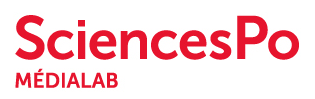

# Join us at FOSDEM 2020
## Saturday 1st of February 2020  from 10:30 to 19:00 ULB, Brussels, Belgium

We invite **developers or users of tools and technologies** used in a research context to contribute to the [FOSDEM 2020](https://fosdem.org) conference.
We understand research as the general process to produce knowledge such as **scientific research, investigative journalism, NGOs fieldwork**, etc.

We seek talks about:
- **New software releases** of research tools or technologies.
- Feedback on **open technology stacks used** in research contexts (e.g., scientific research, journalistic inquiry, archive creation or publication, etc.) which collect, analyse, document, visualize, and/or share data.
- **Tool design and implementation** for specific research contexts, e.g. how to hold an algorithm accountable to social scientists, how to foster better replicability and interoperability thanks to FLOSS, how to cope with biases of a chart for a data journalist, etc.
- Issues and opportunities about **bridging tech culture with research environments** (research labs, libraries, newsrooms, museums, etc.).

Talks will last around *20-40 minutes + 5-10 minutes Q&A*, have to be *in English*, will be video recorded by the amazing FOSDEM staff and will be available on the [FOSDEM video recordings archive](https://video.fosdem.org/).

# HOW TO SUBMIT

**Deadline: 1 Dec 2019 23:59 CET**

Submissions must include:
- Abstract
- Session type *(Lecture or Lightning Talk)*
- Session length *(20-40 min, 10 min for a lightning talk)*
- Expected prior knowledge / intended audience
- Speaker bio
- Links to code / slides / material for the talk *(optional)*
- Links to previous talks by the speaker

Submission process is managed in the Pentabarf system used by the FOSDEM conference.

Apply for a talk: [https://penta.fosdem.org/submission/FOSDEM20](https://penta.fosdem.org/submission/FOSDEM20)

**By submitting a proposal you agree to being recorded and to have your talk made available.**

When submitting your talk in Pentabarf, make sure to select the ‘Open Research Technologies Devroom’ as the ‘Track’.
If you already have a Pentabarf account from a previous FOSDEM event, please reuse it. Create an account if, and only if, you don’t have one from a previous year.

If you have any issues with Pentabarf, do not despair: contact us at `research-devroom[at]lists.fosdem.org`

# The Open Research Technologies devroom

The Open Research Technologies devroom addresses [FLOSS](https://www.gnu.org/philosophy/floss-and-foss.en.html) developers in a broad community concerned with research production and curation: scientists, engineers, journalists, archivists, curators, activists.
The tools and technologies targeted are typically creating, handling or sharing knowledge artifacts: data, academic papers, books, collections, web contents, algorithms, artworks.
This devroom provides a place and time to discuss the issues related to the creation and usage of open research technologies, with the ambition to foster discussions between designers, developers and users, bridging multiple knowledge-based communities together, and with the broader FLOSS community.

The Open Research Technologies devroom aims to:
- Allow knowledge-based tool developers to publicize their effort and become aware of other FLOSS projects.
- Facilitate the pooling of coding efforts on (often poorly funded) tools.
- Create a network where otherwise isolated developers, research engineers can share common FLOSS concerns.
- Provide social recognition for people who work in fields where designing and developing tools is less considered than usual outcomes (e.g. not publishing papers in research, not writing investigation in data journalism, etc).

# What is FOSDEM?

The FOSDEM (Free and Open source Software Developers' European Meeting) is a non-commercial, volunteer-organized European event centered on free and open-source software development. It is aimed at developers and anyone interested in the free and open-source software movement. It aims to enable developers to meet and to promote the awareness and use of free and open-source software.  
[https://fosdem.org/](https://fosdem.org/)  
[https://en.wikipedia.org/wiki/FOSDEM](https://en.wikipedia.org/wiki/FOSDEM)

# Other devrooms might interest you

Even if the FOSDEM is not science-specific, you might be interested by many other talks. Some developer rooms have a scope that resonates with research, for instance:
- [HPC, Big Data, and Data Science](https://fosdem.org/2020/schedule/track/hpc_big_data_and_data_science/)
- [Graph systems and algorithms](https://fosdem.org/2020/schedule/track/graph_systems_and_algorithms/)
- [Open source design](https://fosdem.org/2020/schedule/track/open_source_design/)
- [Community](https://fosdem.org/2020/schedule/track/community_devroom/)

Of course you will also be able to find high quality talks in your own area of expertise in the [50+ devrooms](https://fosdem.org/2020/schedule/) (Python, Java, Rust, PostgreSQL, etc.).

Finally, you may appreciate the prestigious keynotes in the main amphitheater *(to be announced)*.

# Organizers

- Paul Girard, [Sciences Po médialab](https://medialab.sciencespo.fr), [@paulgirard](https://github.com/paulgirard)
- Mathieu Jacomy, [Aalborg University TANT Lab](https://www.tantlab.aau.dk/), [@jacomyma](https://github.com/jacomyma)
- Achilleas Koutsou, [G-Node](http://www.g-node.org), [@achilleas-k](https://github.com/achilleas-k)
- Michael Sonntag, [G-Node](http://www.g-node.org), [@mpsonntag](https://github.com/mpsonntag)

Paul and Mathieu were colleagues at Sciences Po médialab.
Achilleas and Michael are colleagues at the German Neuroinformatics Node.
We met because we submitted two very related "Open Science" proposals for FOSDEM 2020!

Contact us: `research-devroom[at]lists.fosdem.org`

