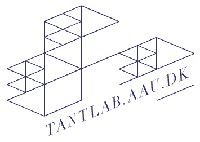
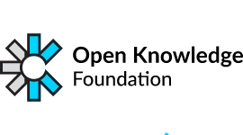
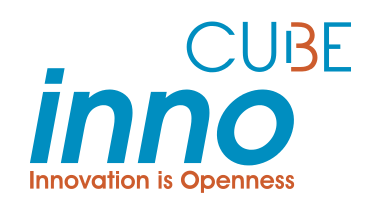
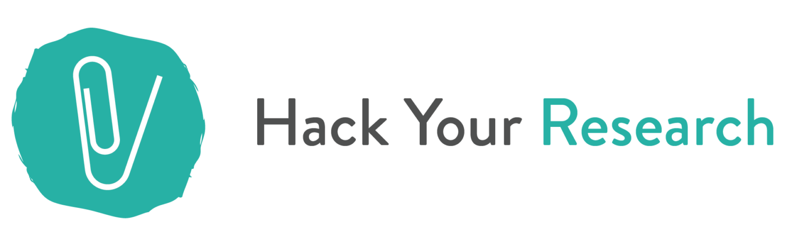

<!-- [**Attend online and chat**](https://chat.fosdem.org/#/room/#research:fosdem.org) or with [just the video](https://live.fosdem.org/watch/dresearch). -->
# CALL FOR PRESENTATIONS OPEN

<!-- ### 👉 Join us Saturday 3 February 2024, Université Libre de Bruxelles and Saturday 10 online! -->

We invite **developers and users of open tools and technologies** used in a research and investigation context to contribute to the 2024 edition of [FOSDEM](https://fosdem.org), the largest open-source conference in Europe.
We understand research as the general process of knowledge production and inquiry. This includes **scientific research, investigative journalism, data journalism, OSINT, as well as research and investigations undertaken by NGOs, civil society, community and activist groups**, etc.

We seek talks about:

- **New releases of open source software**. Introduce a new tool or infrastructure about knowledge production or management. We appreciate context about the project, at the crossroads of open source software and open science.
- Present and/or ask for feedback on **open technology stacks** used in a knowledge creation or production project (research, journalistic inquiry, archive creation or publication…) which collects, analyses, treats, documents, visualizes, and/or shares data.
- Discuss **tool design and implementation** that enhance the understanding and literacy of inquiry outputs: data visualisation techniques and issues, knowledge access and exploration means. E.g., how to hold an algorithm accountable to social scientists; how to foster better reproducibility and interoperability thanks to FLOSS; or how to cope with biases of a chart for a data journalist.
- Contribute to the debate about **bridging tech culture with research and investigative environments** (data journalism, investigative journalism, activism and academia), including tips and best practices for navigating tensions, as well as the contribution of the open source movement to research and investigations sustainability through organizational hosting, funding for projects, support and maintenance, etc.)
- Share your experience about building open source devices or communities across a variety of research and investigative contexts.

We welcome talks from various research and investigative contexts: research labs, libraries, newsrooms, museums, hackerspaces, maker labs, community and activist groups. We welcome your experience on various topics: open science, open data, commons, research on research, sustainability... Any subjects related to open source technologies in research contexts are welcome even if not in this list.

You will find a summary of what happened in our devroom the first two years in this blog post: [reticular.hypotheses.org/1825](https://reticular.hypotheses.org/1825)

## Event and talks format

Our official devroom consists of 6 hours of talks held physically in Bruxelles. In addition, we will hold an _unofficial_ session consisting of about 4h of online talks.

_Note: The online session will not be appearing on the FOSDEM website; that's why it's unofficial._

#### 1. Talks

- Lecture talks (normal talks) will last _25 minutes max_, followed by 5 minutes for questions and changing speaker. A 20/10 split also works.
- Lightning talks will last _15 minutes max_ or a bit less if you want room for questions.

Talks have to be _in English_ and will be recorded and later on published under Creative Commons CC-BY licence on the [FOSDEM video recordings archive](https://video.fosdem.org/). The unofficial, online talks will also be recorded and published, but somewhere else (more on this soon).

#### 2. Event format

The FOSDEM will be entirely **physical** this year (in Bruxelles), and our online session will be held unofficially one week later. All the talks can be seen online via a stream.

# HOW TO SUBMIT

#### 1. Important dates:

- **Proposal Deadline: 10 Dec 2023 23:59 CET**
- **Accepted talk announced: 2023-12-15**
- **FOSDEM Conference: Saturday 3rd Feb 2024** morning + afternoon at Université libre de Bruxelles, Solbosch campus.
- **unofficial online session: Saturday 10th Feb 2024** hours to be precised soon.
- Submit early if you can!

#### 2. Submissions

Must include:
- Title
- Abstract 
- Description
- Talk licence: FOSDEM is an open-source software conference, please specify which OSI approved license your proposal uses.
- Speaker name, contact, biography and availability

Can include:
- Submission notes: write if you want to give a Lightning talk or Lecture here. Add any other details as needed (visible only to devrooms managers)
- Session Image:  Use this if you want an illustration to go with your proposal. Please do not upload files larger than 10.0 MB.
- Additional speaker: you can add co-author
- Extra review material: private materials you want to show to reviewers

Please make sure to add links to relevant online materials (such as website, publications, code repository...) to either abstract or extra review material.
   

To get inspired on possible abstracts style, length and format, you can read previous edition talks on FOSDEM archives:

- [Open Research @ FOSDEM 2023](https://archive.fosdem.org/2023/schedule/track/open_research_tools_and_technology/)
- [Open Research @ FOSDEM 2022](https://archive.fosdem.org/2022/schedule/track/open_research_tools_and_technologies/)
- [Open Research @ FOSDEM 2021](https://archive.fosdem.org/2021/schedule/track/open_research_tools_and_technologies/)
- [Open Research @ FOSDEM 2020](https://archive.fosdem.org/2020/schedule/track/open_research_tools_and_technologies/)

#### 3. How to submit for the PHYSICAL talks (Pretalx tips)

For the official, physical session, the submission process is managed in the Pretalx system used by the FOSDEM conference.
You must create an account in the system to submit (Pretalx replaces the previous pentabarf system you need to create a new user account).
Once logged in, select “submit a CFP” and select the "Open research" track.

**Apply for a _physical_ talk: [https://pretalx.fosdem.org/fosdem-2024/cfp](https://pretalx.fosdem.org/fosdem-2024/cfp)**

If you have any issues with Pretalx, do not despair: contact us at [open-research-devroom-manager@fosdem.org](mailto:open-research-devroom-manager@fosdem.org).

Follow us [on Mastodon (@FosdemResearch@fosstodon.org)](https://fosstodon.org/web/@FosdemResearch) for updates and announcements.

#### 4. How to submit for the ONLINE session

Send an email to us with your submission. Just write in the email the necessary information (see point 2. above).

**Apply for an _online_ talk:  [open-research-devroom-manager@fosdem.org](mailto:open-research-devroom-manager@fosdem.org)**

<!--
# [2022 Schedule](https://link.infini.fr/open-research-2022-schedule)

We have selected 19 great talks of 15 to 20 minutes, with Q&A panels, for a full session from 10:00 to 18:00. [Check our lineup!](https://link.infini.fr/open-research-2022-schedule)

👉 [Follow us on Twitter](https://twitter.com/FosdemResearch) for more coverage.
-->

# About the Open Research devroom

The Open Research devroom addresses [FLOSS](https://www.gnu.org/philosophy/floss-and-foss.en.html) developers in a broad community concerned with research production and curation: scientists, engineers, journalists, archivists, curators, activists.
The tools and technologies targeted are typically creating, handling or sharing knowledge artifacts: data, academic papers, books, collections, web contents, algorithms, artworks.
This devroom provides a place and time to discuss the issues related to the creation and usage of open research technologies, with the ambition to foster discussions between designers, developers and users, bridging multiple knowledge-based communities together, and with the broader FLOSS community.

The Open Research devroom aims to:

- Allow knowledge-based tool developers to publicize their effort and become aware of other FLOSS projects.
- Facilitate the pooling of coding efforts on (often poorly funded) tools.
- Create a network where otherwise isolated developers, research engineers can share common FLOSS concerns.
- Provide social recognition for people who work in fields where designing and developing tools is less considered than usual outcomes (e.g. not publishing papers in research, not writing investigation in data journalism, etc).

For more content information, you can also read about the [state of the conversation](https://reticular.hypotheses.org/1825) in the devroom in 2020-2021.

# What is the FOSDEM?

The FOSDEM (Free and Open source Software Developers' European Meeting) is a non-commercial, volunteer-organized European event centered on free and open-source software development. It is aimed at developers and anyone interested in the free and open-source software movement. It aims to enable developers to meet and to promote the awareness and use of free and open-source software.  
[https://fosdem.org/](https://fosdem.org/)  
[https://en.wikipedia.org/wiki/FOSDEM](https://en.wikipedia.org/wiki/FOSDEM)

# Organizers

- Anne Lee Steele
- Célya Gruson-Daniel [Inno3](https://inno3.fr/) and [COSTECH Lab](https://costech.utc.fr/Le-COSTECH) (Université de Technologie de Compiègne)
- Diego Antolinos-Basso, research engineer at the [médialab](https://medialab.sciencespo.fr/) and the [CEVIPOF](https://www.sciencespo.fr/cevipof/), Sciences Po Paris
- Luisa Orozco, Research Software Engineer at the [Netherlands eScience center](https://www.esciencecenter.nl/).
- Mathieu Jacomy, assistant professor at the [Tantlab](https://www.en.culture.aau.dk/research/research-groups/tantlab) in Copenhagen and designer of [Gephi](https://gephi.org/).
- Maya Anderson-González
- Paul Girard, Human Data Interfaces engineer at [OuestWare](https://ouestware.com)
- Sara Petti, Network Lead at [Open Knowledge Foundation](https://okfn.org/)
- Victor Daussy-Renaudin
- [Violeta Menéndez González](https://violetamenendez.github.io/), PhD student in Computer Vision at University of Surrey and BBC R&D.
- Yo Yehudi

Contact us: [open-research-devroom-manager@fosdem.org](mailto:open-research-devroom-manager@fosdem.org)

Want to view the **schedule for the online talks**? Use this [link](/2024-online-schedule.html)! 

<!-- `research-devroom-manager [at] fosdem.org` -->

<!--  -->

<!--  -->

<!--  -->

<!--  -->

<!--  -->

<!--  -->

<!--  -->

<!--  -->

<!--  -->
